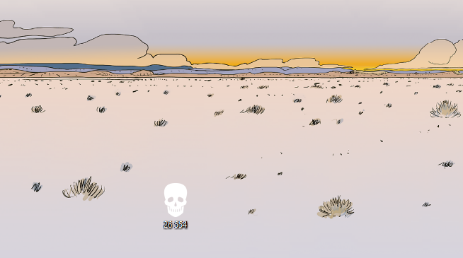

# death-clock-widget
 Folder with an icon of a skull and filename updating you everyday on how much days you have left.

## How it looks:
 

## Usage:
- put the skull icon (the 'death clock') somewhere to your preference (I recommend to just put it on the Desktop)
- replace DEATH_DATE in line 9 of death_clock.pyw with your estimated date of death (there are websites to estimate that)
- replace DEATH_CLOCK_PATH to path in which you put the death clock
- fill the paths in ScheduleTask.bat according to instructions next to variable names
- run ScheduleTask.bat to set a daily scheduled task of updating days left on the death clock