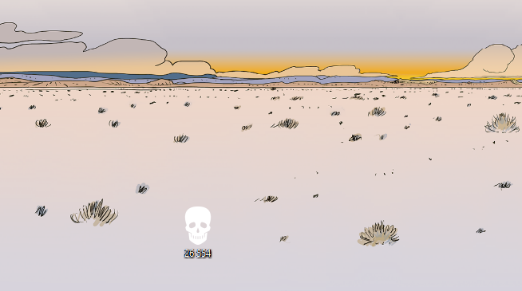

# death-clock-widget
> The truth is that we are only here for a short while.
> 
> Yet the calender on the wall displays days from here until eternity. The watch winds up instead of down.
> 
> This is complete deception, is it not?
> 
> The only worthwhile watch in the world is not the one which counts Up, but the one which counts Down. **Not the watch which tells you what time It Is. But the watch which tells you how much time you Have Left.**
> 
> Unless we Viscerally come face to face with our own demise...
> 
> We will never know death.
> 
> ~ Kapil Gupta

## How it looks:
 

## Usage:
- put the skull icon (the 'death clock') on your Desktop
- replace `DEATH_DATE` in line 9 of `death_clock.pyw` with your estimated date of death (there are websites to do that)
- replace `DEATH_CLOCK_PATH` with the actual death clock path
- fill the paths in `ScheduleTask.bat` according to descriptions next to variable names
- run `ScheduleTask.bat` to set a daily scheduled task of updating days left on the death clock (You can manage all of your tasks directly from Windows Task Scheduler)
